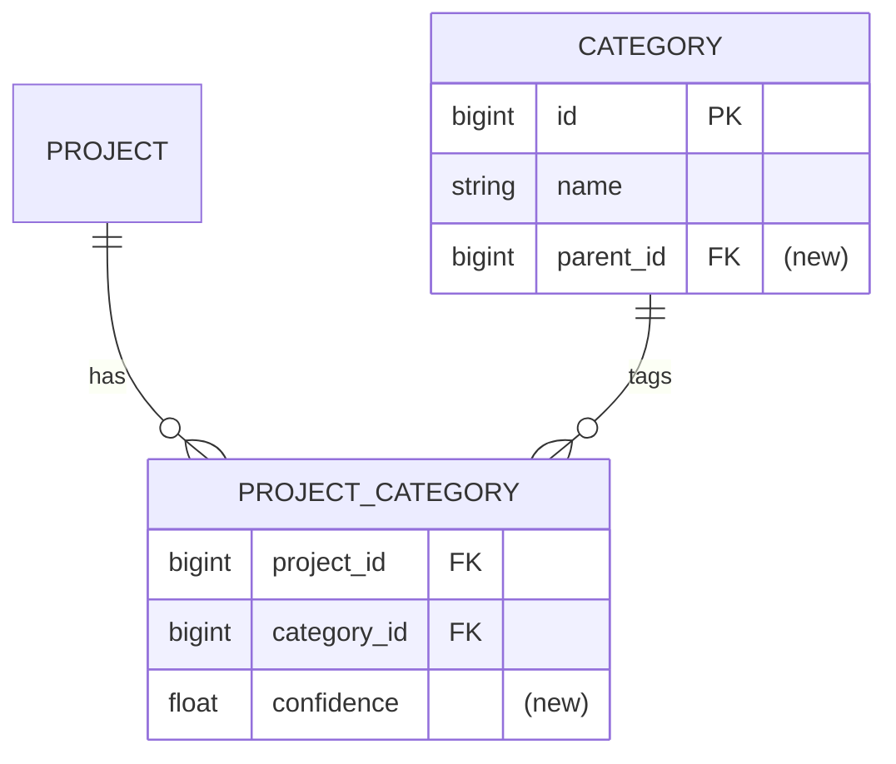

# Spec: [FEATURE NAME]

**Input:** verbatim seed text — preserved for traceability

## 1. Goal
One or two sentences.

## 2. Problem
- What's broken / missing today?
- Who's affected (end users, library authors, developers)?

## 3. User scenarios & acceptance
### Scenario 1 — <title> (P1)
- **Given:** <state>
- **When:** <action>
- **Then:** <observable outcome>
- **Independent test:** <how to verify in isolation>

### Edge cases
- What happens when <boundary>?
- How does the system handle <error / partial failure>?

## 4. Functional requirements
- **FR-001:** System MUST …
- **FR-002:** System MUST NOT …
- Mark unknowns inline: `[NEEDS CLARIFICATION: …]`

## 5. Non-functional requirements
*Include only what applies; cut the rest.*
- **Performance:** latency budget, throughput, dataset size
- **External rate limits:** GitHub, Maven Central (repo1 / solrsearch / central.sonatype), OpenAI, S3 — per-IP budgets, klibs egress IPs shared across replicas
- **Concurrency:** scheduling, ShedLock keys, race windows
- **Observability:** new logs / metrics / alerts
- **Security:** auth boundary, token scopes

## 6. Out of scope
Explicit list.

## 7. Klibs.io technical surface
*Mark only lines that apply.*
- **Modules touched:** e.g. `app`, `core/scm-repository`, `integrations/github`
- **Database:** new tables / columns / indexes; migration folder (`db/migration/<YYYY>-Q<n>/`); additive-only? backfill plan?
- **Persistence style:** JPA vs raw JDBC — match the existing pattern in the touched module
- **Search / materialized views:** `project_index` / `package_index` impact
- **External integrations:** APIs called; request volume; retry / backoff
- **Scheduled jobs:** new `@Scheduled`; ShedLock lock names; cadence; idempotency
- **Storage:** S3 prefixes; local cache invalidation
- **Configuration:** new `klibs.*` properties; profile defaults; feature-flag toggle?
- **API surface:** new/changed endpoints; OpenAPI doc; breaking change?
- **Frontend contract:** does `klibs-frontend` need to change?

## 8. Design options considered
*Skip when the implementation is the only sensible one.*

### Option A — <name>
- Approach / pros / cons

### Option B — <name>
- …

**Decision:** Option <X>. Rationale: …

## 9. Key entities (only if data model changes)
- **<EntityName>:** purpose, key fields, relationships, lifecycle

## 10. Database schema diagram (only if schema changes)
*Mermaid ER diagram of the resulting tables. Mark new tables/columns with `(new)`, removed ones with `(removed)`. Skip if schema is unchanged. Renders natively in GitHub and IntelliJ.*

## 11. Test strategy
- **Unit:** which classes, mocking boundary
- **DB-integration:** `BaseUnitWithDbLayerTest` subclasses; method-level `@Sql` seeds
- **Web / smoke:** `SmokeTestBase` for new endpoints
- *Reviewer-only — manual / staging:* what to verify on `klibs-features` / `klibs-stage`

## 12. Assumptions
- …

## 13. References
- Design docs, related specs, prior art
