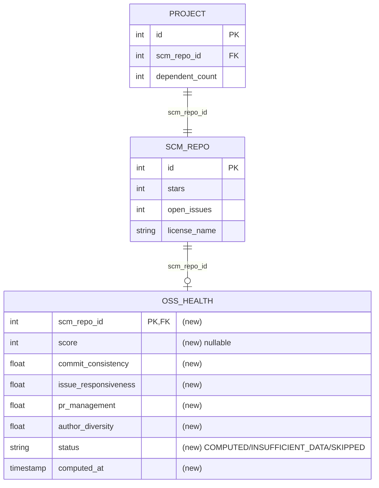

# Spec: OSS Health metric

## 1. Goal

Compute a single, research-backed **OSS Health** score (0–100) per project from its GitHub repository activity, and expose it on the project (including in search results) so maintainers and users have a neutral, composite signal of how actively and sustainably a library is maintained.

## 2. Problem

- klibs.io today exposes only single raw signals about a repository (stars, open-issue count, last activity). Used in isolation these are misleading: a high star count says nothing about whether the project is still maintained, and "last commit" alone hides whether activity is steady or sporadic.
- There is no neutral, composite indicator a maintainer can point to that summarises *maintenance health* — commit cadence, issue/PR responsiveness, and contributor diversity — in one defensible number.
- Affected: **library authors** (want a fair signal of their maintenance effort) and **end users** browsing/searching klibs.io (want to judge whether a library is actively maintained before adopting it).

## 3. User scenarios & acceptance

### Scenario 1 — Actively maintained repo gets a health score (P1)
- **Given:** a non-archived GitHub repository with regular commits, issues, and merged PRs over the last 12 weeks.
- **When:** the OSS Health computation runs for that repository.
- **Then:** a numeric score in `[0,100]` is computed and persisted with status `COMPUTED`; because it is `>= 40` it is returned as a numeric value in the project's search-result payload and project-details payload.
- **Independent test:** seed an `scm_repo` + `project` and a fixture of activity inputs; run the computation; assert via JPA/HQL that a health row exists with status `COMPUTED` and the score matches the formula (§8) for those inputs.

### Scenario 2 — Archived / disabled repo is skipped (P1)
- **Given:** a GitHub repository whose `isArchived` or `isDisabled` flag is true.
- **When:** the repository is selected for OSS Health computation.
- **Then:** no score is computed; the health record's status is `SKIPPED` (not `COMPUTED`), and the project payload exposes `ossHealth` as **null** (not `0`).
- **Independent test:** mark the repo archived in the GraphQL fixture; run the computation; assert via HQL the status is `SKIPPED` and the API response field is null.

### Scenario 3 — Low-activity repo is computed but flagged insufficient (P2)
- **Given:** a repository that is either computed but below the display threshold (score `< 40` — including quiet repos whose zero-denominator dimensions scored 0), or too new to score because it lacks a full 12-week window (`INSUFFICIENT_DATA`, per §8).
- **When:** the computation runs.
- **Then:** the API exposes only the **"insufficient"** indicator for this repo — no numeric score — so the frontend renders "Insufficient activity data"; the raw sub-40 value is never sent.
- **Independent test:** seed sparse activity (resulting score `< 40`, or a repo younger than 12 weeks); assert the response carries the "insufficient" indicator and **no** numeric `ossHealth` value.

### Edge cases
- **Zero commits in the 12-week window** → CV undefined (mean = 0) → `C = 0` and `A = 0`; the repo is still scored (composite reflects any issue/PR activity).
- **Zero issues opened in the window** → issue close ratio `closed/opened` undefined → `I = 0`; the repo is still scored, per §8.
- **Zero PRs opened in the window** → PR merge ratio undefined → `P = 0`; the repo is still scored, per §8.
- **Single contributor** → top-contributor commit share = 1, so the diversity sub-term contribution is 0; this is a valid low (not an error).
- **Repository younger than the 12-week window** → partial window; treated as insufficient data.
- **GraphQL call fails / times out for a repo** → the previously persisted score (if any) is retained, the repo is backed off and retried later; one failure does not zero out the score.
- **GitHub REST `/stats/participation` or `/stats/contributors` returns HTTP 202** → not relied upon; all inputs come from GraphQL instead (see §8).

## 4. Functional requirements

- **FR-001:** System MUST expose an `ossHealth` field on the **project search-results payload** and on the **project-details payload**, carrying the OSS Health score as an integer when displayable (see FR-002/FR-005).
- **FR-002:** The `ossHealth` field MUST communicate exactly one of three consumer-visible states: a **numeric score** (`>= 40`), an **"insufficient"** indicator, or **absent/null** (nothing to show). All three MUST be distinguishable by the consumer. (The exact JSON encoding is a plan-level detail; the contract is that the three states are distinguishable.)
- **FR-003:** System MUST NOT compute or report an OSS Health score for an archived or disabled repository; `ossHealth` for such a project MUST be the **absent/null** state of FR-002 — never `0` and never the "insufficient" indicator.
- **FR-004:** The OSS Health score MUST be computed according to the formula and input windows defined in §8 (Decision — OSS Health formula). Given a fixed set of activity inputs, the resulting score MUST be deterministic and reproducible.
- **FR-005:** The backend MUST apply the display cutoff itself: when a computed score is `< 40`, or the repository is too new to score (`INSUFFICIENT_DATA`), the API MUST expose only the **"insufficient"** indicator and MUST NOT include the raw numeric value. The numeric `ossHealth` value MUST be present **only** when the score is `>= 40`. The frontend never receives a sub-40 number and applies no cutoff of its own.
- **FR-006:** OSS Health scores MUST be refreshed over time so the value reflects recent activity; a stale score MUST eventually be recomputed without manual intervention.

## 5. Non-functional requirements

- **External rate limits — GitHub GraphQL:** The GitHub GraphQL API is metered by a **point budget of 5000 points/hour per authenticated token** (point-based, *not* per-IP). klibs.io uses a single personal access token (`klibs.integration.github.personal-access-token`), so this budget is shared across all replicas — independent of the shared Cloud NAT egress IPs. GraphQL's point budget is **separate** from the REST request budget the existing kohsuke jobs consume, so this job does not eat into their allowance. At the weekly cadence (~3800 repos → ~24 repos/hour), even at tens of GraphQL points per repo the job uses a small fraction of the 5000 pts/hour budget.
- **Concurrency / scheduling:** Computation MUST be spread across time — **one repository per scheduled tick** — rather than processing all repositories in a single heavy batch. The job MUST hold a distinct ShedLock lock so only one instance runs at a time. Per-repo failures MUST back off and retry (reuse the existing backoff pattern) without blocking other repos.
- **Performance / staleness:** ~**3800** repositories. Target a **weekly** full-corpus refresh. At one repo per tick, a complete weekly sweep needs a tick every `604800 s / 3800 ≈ 160 s` — i.e. **one repo every ~2.5–3 minutes** sweeps the whole corpus in ~7–8 days. The tick interval is a configurable `klibs.*` property defaulting to that range. No tighter staleness target is known; weekly is adequate because the inputs are 12-week aggregates that move slowly. Revisit if the repo count grows materially.
- **Observability:** Add a Micrometer counter/timer for OSS Health computations (success / skipped / failed) and a gauge for the count of repos pending (re)computation, consistent with the existing GitHub-integration metrics.

## 6. Out of scope

- Number-of-dependents metric (already implemented as `dependent_count`), Google-Analytics-based metrics (page views, search impressions/clicks, snippet copies, outbound clicks), and the author-authentication / GitHub-OAuth work — these are separate RFC line items (P1 / P3) and separate specs.
- Maven Central download counts (no reliable public API).
- Sorting or filtering search results by OSS Health (this spec only *exposes* the field; sorting is not requested).
- GitHub's native `health_percentage` (community-files metric) — not part of this composite.
- Backfill/recompute-all tooling beyond the rolling scheduled refresh.
- Frontend rendering of the score and the "Insufficient activity data" copy (frontend consumes the contract from FR-001/FR-005).

## 7. Klibs.io technical surface

- **Modules touched:**
  - `integrations/github` — add a GraphQL-based capability to fetch commit history, issues, and PRs (new methods on `GitHubIntegration`).
  - `core/scm-repository` — new persisted OSS Health data keyed to the repository, plus a JPA entity + repository for it.
  - `core/search` — add `ossHealth` to `project_index`, `SearchProjectResult`, `SearchProjectResultDTO`, and the row mapper.
  - `core/project` — add `ossHealth` to `ProjectDetailsDTO`.
  - `app` — new `@Scheduled` job (one repo per tick) + service wiring.
- **Database:** New table for health, keyed by `scm_repo` (one row per repository). Stores: composite score, the four component sub-scores (commit consistency, issue responsiveness, PR management, author diversity), a status enum (`COMPUTED`, `INSUFFICIENT_DATA`, `SKIPPED`, and the implicit "no row yet" = not computed), and a `computed_at` timestamp. Additive-only migration in `db/migration/2026-Q2/` (current quarter). Column types/index choices are plan-level. Backfill: none required — rows are created by the rolling job.
- **Persistence style:** **JPA + HQL** for the new health entity/repository and for test validation, per the explicit request. This deliberately diverges from the JDBC pattern used elsewhere in `core/scm-repository` (`ScmRepositoryRepositoryJdbc`); see §8.
- **Search / materialized views:** `project_index` must be recreated to add the `ossHealth` column (join `project → scm_repo → oss health`), following the existing recreate-view-with-new-column migration pattern (e.g. the `dependent_count` recreation). `package_index` unaffected.
- **External integrations:** GitHub **GraphQL** (`https://api.github.com/graphql`) for commit history (weekly buckets + per-author counts), issues (created/closed timestamps), and PRs (created/merged timestamps). Existing REST `/stats/participation` and `/stats/contributors` are intentionally **not** used (they return 202 while GitHub computes stats asynchronously, which is unreliable for an on-demand job). Per-repo backoff/retry.
- **Scheduled jobs:** New `@Scheduled` job in `app`, one repository per tick, distinct `@SchedulerLock` name (e.g. `updateOssHealthLock`), selecting the stalest health record (analogous to `findMultipleForUpdate`). Idempotent: recomputing yields the same score for the same inputs.
- **Configuration:** New `klibs.*` properties: the job tick interval (default ~2.5–3 min, sized for a weekly sweep of ~3800 repos), the display threshold (default `40`), and an on/off toggle (default **on**, overridable to suppress the job in tests/environments). No profile gating.
- **API surface:** Additive field `ossHealth` on the search-results and project-details responses; update OpenAPI docs. Additive only — not a breaking change.
- **Frontend contract:** `klibs-frontend` will need to read `ossHealth` and the displayable/insufficient state, and render "Insufficient activity data" below the threshold. Out of scope here but the contract (FR-001, FR-005) is the dependency.

## 8. Design decisions

### Decision — OSS Health formula (simplified CSI, monotonic)
- **Choice:** Adopt the four-dimension Composite Stability Index from *Introducing Repository Stability* (arXiv 2504.00542), but with the simplified, **monotonic** normalization the RFC settled on (more activity → higher score, capped at 1), rather than the paper's bell-shaped `ϕ(x)=1−|x−μ|/σ` that also penalises "too much" activity. Weights are kept from the paper.

  ```
  OssHealth = round(100 * (0.30*C + 0.25*I + 0.25*P + 0.20*A))

  # C — Commit consistency (12-week window)
  #   CV = stddev / mean of the 12 weekly commit counts   (population CV; RFC's "mean/std" is a typo)
  C = max(0, 1 - CV / 0.6)

  # I — Issue responsiveness (12-week window)
  IssueCloseRatio   = issuesClosedInWindow / issuesOpenedInWindow
  MedianIssueCloseDays = median close time of issues closed in window
  I = 0.5 * min(1, IssueCloseRatio / 0.4)
    + 0.5 * max(0, 1 - MedianIssueCloseDays / 21)

  # P — Pull-request management
  PRMergeRatio     = prsMergedInWindow / prsOpenedInWindow
  MedianPRMergeDays = median merge time of PRs merged in window
  P = 0.5 * min(1, PRMergeRatio / 0.5)
    + 0.5 * max(0, 1 - MedianPRMergeDays / 14)

  # A — Author diversity (12-week window)
  ActiveContributors        = distinct authors with >=1 commit in last 12 weeks
  TopContributorCommitShare = top author's commits / total commits in window
  A = 0.6 * min(1, ActiveContributors / 5)
    + 0.4 * (1 - TopContributorCommitShare)

  # Zero-denominator handling (all over the 12-week window):
  #   issuesOpenedInWindow == 0  -> I = 0
  #   prsOpenedInWindow    == 0  -> P = 0
  #   commitsInWindow      == 0  -> C = 0 and A = 0   (CV undefined)
  #   repo younger than 12 weeks -> not scored; status = INSUFFICIENT_DATA
  ```
- **Why:** The paper's bell-shaped normalization would penalise very active projects (e.g. a high commit rate scores *lower*), which is counter-intuitive and demoralising for an author-facing signal — contrary to the RFC anti-goal "don't make authors feel bad". Monotonic-capped terms are easier to explain and defend. Weights `[0.30, 0.25, 0.25, 0.20]` are taken unchanged from the paper. Using a composite (rather than any single raw metric) is itself supported by arXiv 2309.12120, which finds single context-free indicators insufficient for sustainability judgments.
- **Rejected:**
  - *Paper-exact CSI* (bell-shaped `ϕ`, target values μ/σ) — penalises healthy high activity; harder to explain.
  - *Repository-centrality / network-lifespan model* (arXiv 2405.07508) — requires building a cross-repo user–repository graph; far too much computation for klibs.io's per-repo budget.
  - *Single raw metric* (stars / last-commit / issue count alone) — rejected on the evidence of arXiv 2309.12120.
- **Revisit if:** authors report the score feels unfair, or the chosen target constants (0.6, 0.4, 21d, 0.5, 14d, 5, etc.) produce poorly-distributed scores on real data — these constants should be validated against a sample of indexed repos before launch.
- **Resolved — window:** a single **12-week** window applies to all four dimensions (commit, issue, PR, author).
- **Resolved — zero denominators:** an undefined sub-term caused by a zero denominator contributes **0** to its dimension; the repository is still `COMPUTED`. Specifically: `issuesOpenedInWindow == 0` → `I = 0`; `prsOpenedInWindow == 0` → `P = 0`; `commitsInWindow == 0` (CV undefined) → `C = 0` **and** `A = 0`. **Consequence:** a stable / "finished" library with little or no recent activity earns a genuine *low* composite score, which the `< 40` display gate (FR-005) then renders as "Insufficient activity data" — matching the RFC's display rule, rather than a separate status.
- **Resolved — `INSUFFICIENT_DATA` status:** reserved for repositories too new to have a full 12-week window; these are not scored. (Archived/disabled repos → `SKIPPED`; a repo with no row yet → "not computed".)

### Decision — Compute all inputs from GitHub GraphQL, not REST stats or daily snapshots
- **Choice:** Fetch every input via the GitHub GraphQL API: commit history over 12 weeks (yields both weekly buckets for C *and* per-author commit counts for A in one traversal), `issues` with `createdAt`/`closedAt`, and `pullRequests` with `createdAt`/`mergedAt`. Read `isArchived`/`isDisabled` from the same GraphQL repository query to drive the skip decision.
- **Why:** The REST `/stats/participation` and `/stats/contributors` endpoints return HTTP 202 while GitHub computes stats asynchronously and are unreliable for an on-demand job (user-confirmed). The RFC's "daily diff snapshot of openIssueCount" approach is also unsound here: GitHub's open-issue count *includes PRs*, so deltas can't separate the issue and PR dimensions — GraphQL gives clean, separately-queryable issue and PR sets with exact timestamps. A single commit-history traversal covers two of the four dimensions.
- **Rejected:** REST `/stats/*` (202 / async, unreliable); daily snapshot deltas (conflates issues+PRs, only nets, no medians).
- **Revisit if:** GraphQL point cost per repo proves too high for the weekly cadence within the 5000 pts/hr shared budget.

### Decision — New GraphQL client over existing OkHttp, no new dependency
- **Choice:** Implement GraphQL calls by POSTing queries to `api.github.com/graphql` using the already-present OkHttp client and the existing GitHub PAT, exposed as new methods on `GitHubIntegration`. The kohsuke `github-api` library (used for all current REST calls) does not provide first-class GraphQL support.
- **Why:** Avoids adding a GraphQL-client dependency (CLAUDE.md: avoid dependency upgrades), reuses existing auth and HTTP infrastructure and the existing Micrometer/metrics conventions.
- **Rejected:** Adding a dedicated GraphQL client library — unnecessary dependency for a handful of queries.

### Decision — Persist health in a new JPA-mapped table keyed by `scm_repo`
- **Choice:** A new table (one row per repository) holding composite score, the four sub-scores, a status enum, and `computed_at`. Accessed via a **JPA entity + Spring Data JPA repository**, with validation/tests using **HQL**.
- **Why:** Keys to the repository because the metric is entirely repository-derived (and avoids recomputation if multiple projects ever map to one repo); persisting the four sub-scores keeps the score auditable/explainable and supports HQL-based test assertions. JPA+HQL is the user's explicit preference for this feature.
- **Rejected:** Raw JDBC (`ScmRepositoryRepositoryJdbc` style) — matches the module's existing pattern but the user explicitly preferred JPA/HQL here; storing only the composite score (no sub-scores) — loses explainability and makes the formula untestable component-by-component.
- **Tension to confirm:** CLAUDE.md says "match the existing persistence pattern in the touched module" (JDBC). Using JPA here is a deliberate, user-requested divergence — flag for reviewer.

### Decision — Apply the `< 40` display gate at the response-mapping layer
- **Choice:** Persist (and store in `project_index`) the **raw** computed score in `[0,100]`; apply the `< 40` cutoff when building the response DTOs — below threshold, emit the "insufficient" indicator and omit the number. The threshold is a config property (`klibs.*`, default `40`).
- **Why:** Keeps the raw score available for debugging, metrics, and threshold tuning without re-running the materialized view; the cutoff is a presentation rule that can change without a migration. Satisfies FR-005 (the raw sub-40 value never crosses the API boundary).
- **Rejected:** Storing the already-gated value in the view/DB — would bake the threshold into a migration and lose the raw score for analysis.

### Decision — Rolling one-repo-per-tick scheduled job with backoff
- **Choice:** A new `@Scheduled` job that picks the single stalest health record each tick, computes its score, persists it, and applies the existing exponential backoff on failure. Distinct ShedLock lock `updateOssHealthLock`.
- **Why:** Mirrors the proven `GitHubRepositoryUpdatingJob` pattern (`findMultipleForUpdate` + `BackoffProvider`), spreads GraphQL point usage smoothly across the hour/week (user-requested), and keeps the heavy work off any single tick.
- **Rejected:**
  - *One heavy weekly batch over all repos* — spikes the GraphQL budget and risks long lock-holds / partial failures.
  - *Folding the computation into the existing `GitHubRepositoryUpdatingJob`* — that job runs every 30s, processes 3 repos/tick, hits cheap REST (kohsuke), and refreshes repo metadata far more often than health needs. Reusing its cadence would massively overshoot both the ~weekly health cadence and the 5000 pts/hr GraphQL budget; suppressing that with an inline "is health stale?" gate would couple two concerns with different selection orderings (stalest *metadata* row ≠ stalest *health* row), different rate-limit budgets (REST token vs GraphQL points), and different failure modes (a GraphQL secondary-limit shouldn't back off cheap metadata refresh, and vice versa). A separate job keeps failure isolation and budgeting clean and matches the existing one-job-per-concern layout (owner-update job, materialized-view job).
- **Revisit if:** the health computation turns out to need only a cheap, single call per repo after all — then piggybacking on the existing visit becomes attractive.

## 9. Key entities

- **`OssHealthEntity`** (working name): one row per `scm_repo`.
  - **Key fields:** `scmRepoId` (FK / identity to `scm_repo`), `score` (0–100, nullable when not displayable), `commitConsistency`, `issueResponsiveness`, `prManagement`, `authorDiversity` (the four component sub-scores in `[0,1]`), `status` (`COMPUTED` / `INSUFFICIENT_DATA` / `SKIPPED`), `computedAt` (Instant; JVMs run UTC, map Instant ↔ TIMESTAMP accordingly).
  - **Relationships:** one-to-one with `ScmRepositoryEntity`; surfaced per `project` via `project.scm_repo_id`.
  - **Lifecycle:** created/updated by the rolling job; absence of a row = "not yet computed"; `SKIPPED` for archived/disabled repos; `INSUFFICIENT_DATA` for repos too new for a full 12-week window; `COMPUTED` otherwise (zero-denominator dimensions score 0); recomputed on the weekly cadence.

## 10. Database schema diagram



## 11. Test strategy

- **Unit:** Score calculator class — pure function of activity inputs → score; cover each dimension, the zero-denominator edge cases, the CV-undefined case, and a full worked example (pin exact score for a fixed input set). Mock the GraphQL boundary; test the archived/disabled skip path.
- **DB-integration:** `BaseUnitWithDbLayerTest` subclass with method-level `@Sql` seeds; persist a health row and assert via **HQL / the JPA repository** that the score, sub-scores, and status round-trip and that the project-search join surfaces `ossHealth` correctly (and null for `SKIPPED`).
- **Web / smoke:** `SmokeTestBase` — assert `ossHealth` appears in the search-results and project-details responses, and that "not computed" vs "insufficient" vs a real score are distinguishable in the JSON.
- **Reviewer-only — manual / staging:** On `klibs-features`, let the rolling job run against real repositories; validate the score distribution looks sane (not all clustered at 0 or 100), confirm archived repos are skipped, and confirm the GraphQL point budget stays within 5000/hr alongside existing GitHub jobs.

## 12. Assumptions

- A `project` maps to exactly one `scm_repo` (1:1) for the purpose of exposing the score; keying health by `scm_repo` therefore yields one value per project.
- The single existing GitHub PAT has GraphQL access and sufficient point budget to add a weekly-per-repo health pass on top of current REST traffic.
- The RFC's chosen simplified formula (and its weights/constants) is the intended contract; the paper-exact CSI is reference only.
- "Spread across time, one repo per period" maps onto the existing one-repo-per-tick scheduled-job pattern (`@Scheduled` + ShedLock + backoff), not a new infrastructure mechanism.
- A single 12-week window applies to all four dimensions.

## 13. References

- RFC: *Author insights for klibs.io* (KTL-4246), section "OSS Health index".
- *Introducing Repository Stability* — arXiv 2504.00542 (2025): source of the four-dimension CSI, weights `[0.30, 0.25, 0.25, 0.20]`, and per-dimension definitions.
- *Individual context-free online community health indicators fail to identify open source software sustainability* — arXiv 2309.12120 (2023, rev. 2024): justification for a composite over any single raw metric.
- *Revealing the value of Repository Centrality in lifespan prediction of OSS Projects* — arXiv 2405.07508 (2024): considered and rejected (too compute-heavy).
- Existing pattern references in-repo: `app/.../job/GitHubRepositoryUpdatingJob.kt`, `core/scm-repository/.../ScmRepositoryRepositoryJdbc.kt`, `core/search/.../SearchProjectResultDTO.kt`, the `2026-Q2` `dependent_count` column + `project_index` recreation migrations.
</content>
</invoke>
